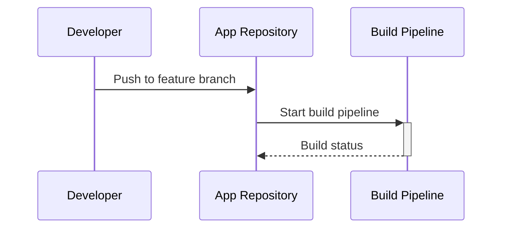
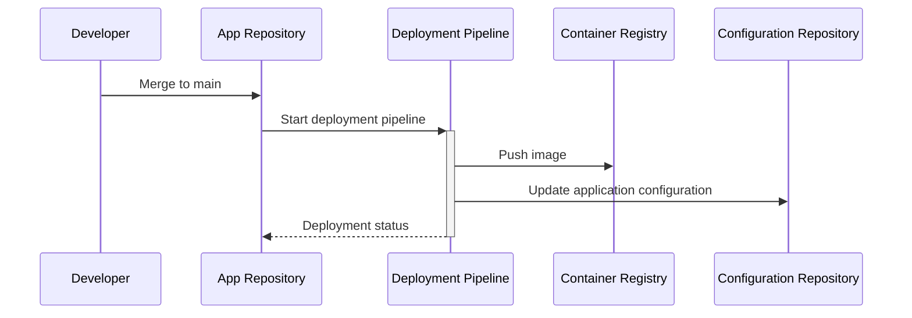
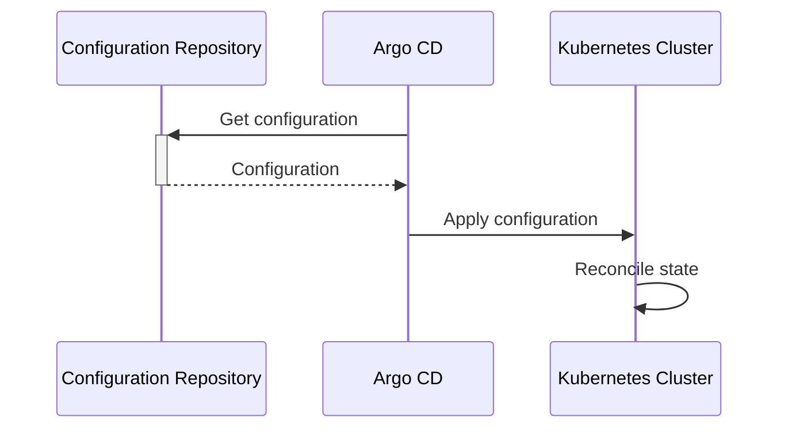

# DevOps Dreamland

This is a playground to implement and try out different DevOps
techniques and tools. It serves my personal learning and as a proof of
concept for an end to end DevOps process.

This repository contains a demo application to simulate the software
development lifecycle of a real application. It is deployed to a
Kubernetes cluster. The deployment configuration is stored in the
[devops-dreamland-config](https://github.com/tfkhim/devops-dreamland-config)
repository.

**Disclaimer:** This is mostly a proof of concept. Many implementation
details may not be as elegant as they could be. The focus is on the
interactions between the various parts and not the best possible
implementation of each part.

# Goals

The following section describes some of the goals this project tries
to achieve.

## Automation

Manual and repetitive work is boring and error-prone. Therefore it is
essential to automate tasks that have to be repeated for each commit
or deployment. Good examples for such tasks are tests, linting,
dependency version increments, creating release information, release
packaging and deployment. Last but not least automation is a key
requirement for some of the other goals.

## Reproducibility

One should always get the same observable behavior of a deployed
application if the same commit is built and deployed multiple times.
This is a very strict rule and it might not be necessary to be so
strict about it. You could for example embed a build timestamp into
your application that leads to some difference in the output. For most
of us this will be still fine because the overall behavior of the
application doesn't change.

Reproducibility reduces the complexity of finding the root cause for
some unwanted behavior. Imagine each build could have different behavior
even if the source code didn't change. In such a scenario you would
never know if some observed change in behavior is due to a change in
the source code or caused by something completely different.

## Auditability

It should be possible to figure out which change was done at which
point in time. For classic software development this has been done
for years by using a version control systems. Together with
reproducibility this approach provides good debugging capabilities. 

But the software alone doesn't define an application. In a DevOps
world one wants to extend this approach also to the infrastructure to
gain the same benefits there.

## Fun To Work With

Everyone has their own opinion on what is fun to work with. But I think
there are some properties that many can agree on:

* Reduce boring repetitive tasks to the minimum
* Being able to make progress. Reducing lead times is important to
  increases the feeling of getting something done
* No bad surprises
* Using well supported and widely adopted tools

# Release Process

This section describes the release process. It gives a short overview
how a source code change will lead to a new deployed application
version.

## High Level View

Feature development is done in a feature branch. Most of the quality
assurance steps are part of the build pipeline that runs after pushing
code to the feature branch. Merging to the main branch should only be
possible if all the checks in the build pipeline pass.

Merging the changes of a feature branch to the main branch then
triggers the deployment pipeline. The deployment pipeline creates a
container image and pushes it to a registry. It then updates the
configuration in the
[devops-dreamland-config](https://github.com/tfkhim/devops-dreamland-config)
repository to use the new container image.

The Kubernetes cluster runs an instance of
[Argo CD](https://argoproj.github.io/cd/). This piece of software
monitors the configuration repository for any changes. If it detects a
change it can automatically reconcile the cluster state to match the
desired state.

